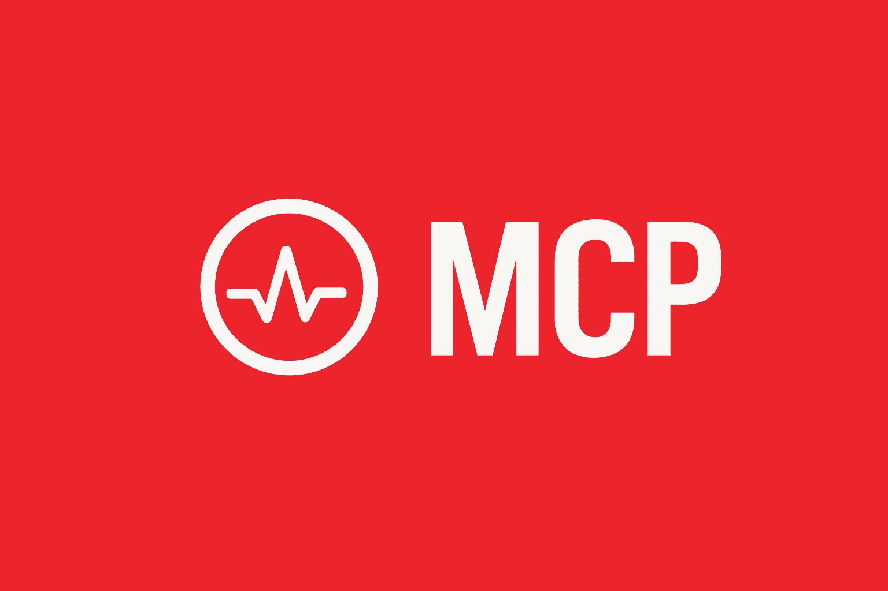

# Intervals.icu MCP Server



A Model Context Protocol (MCP) server for Intervals.icu integration. Access your training data, wellness metrics, and performance analysis through Claude and other LLMs.

[](https://www.python.org/downloads/)

## Overview

This MCP server provides 48 tools to interact with your Intervals.icu account, organized into 9 categories:

- Activities (10 tools) - Query, search, update, delete, and download activities
- Activity Analysis (8 tools) - Deep dive into streams, intervals, best efforts, and histograms
- Athlete (2 tools) - Access profile, fitness metrics, and training load
- Wellness (3 tools) - Track and update recovery, HRV, sleep, and health metrics
- Events/Calendar (9 tools) - Manage planned workouts, races, notes with bulk operations
- Performance/Curves (3 tools) - Analyze power, heart rate, and pace curves
- Workout Library (2 tools) - Browse and explore workout templates and plans
- Gear Management (6 tools) - Track equipment and maintenance reminders
- Sport Settings (5 tools) - Configure FTP, FTHR, pace thresholds, and zones

Additionally, the server provides:

- 1 MCP Resource - Athlete profile with fitness metrics for ongoing context
- 6 MCP Prompts - Templates for common queries (training analysis, performance analysis, activity deep dive, recovery check, training plan review, weekly planning)

## Prerequisites

- Python 3.11+ and [uv](https://github.com/astral-sh/uv), OR
- Docker

## Intervals.icu API Key Setup

Before installation, you need to obtain your Intervals.icu API key:

1. Go to https://intervals.icu/settings
2. Scroll to the **Developer** section
3. Click **Create API Key**
4. Copy the API key (you'll use it during setup)
5. Note your **Athlete ID** from your profile URL (format: `i123456`)

## Installation & Setup

### How Authentication Works

1. API Key - Simple API key authentication (no OAuth required)
2. Configuration - API key and athlete ID saved to `.env` file
3. Basic Auth - HTTP Basic Auth with username "API_KEY" and your key as password
4. Persistence - Subsequent runs reuse stored credentials

### Option 1: Using UV

```bash
# Install dependencies
cd intervals-icu-mcp
uv sync
```

Then configure credentials using one of these methods:

#### Interactive Setup

```bash
uv run intervals-icu-mcp-auth
```

This will prompt for your API key and athlete ID and save credentials to `.env`.

#### Manual Setup

Create a `.env` file manually:

```bash
INTERVALS_ICU_API_KEY=your_api_key_here
INTERVALS_ICU_ATHLETE_ID=i123456
```

### Option 2: Using Docker

```bash
# Build the image
docker build -t intervals-icu-mcp .
```

Then configure credentials using one of these methods:

#### Interactive Setup

```bash
# Create the env file first (Docker will create it as a directory if it doesn't exist)
touch intervals-icu-mcp.env

# Run the setup script
docker run -it --rm \
  -v "/ABSOLUTE/PATH/TO/intervals-icu-mcp.env:/app/.env" \
  --entrypoint= \
  intervals-icu-mcp:latest \
  python -m intervals_icu_mcp.scripts.setup_auth
```

This will prompt for credentials and save them to `intervals-icu-mcp.env`.

#### Manual Setup

Create an `intervals-icu-mcp.env` file manually in your current directory (see UV manual setup above for format).

## Claude Desktop Configuration

Add to your configuration file:

- macOS: `~/Library/Application Support/Claude/claude_desktop_config.json`
- Windows: `%APPDATA%\Claude\claude_desktop_config.json`

### Using UV

```json
{
  "mcpServers": {
    "intervals-icu": {
      "command": "uv",
      "args": [
        "run",
        "--directory",
        "/ABSOLUTE/PATH/TO/intervals-icu-mcp",
        "intervals-icu-mcp"
      ]
    }
  }
}
```

### Using Docker

```json
{
  "mcpServers": {
    "intervals-icu": {
      "command": "docker",
      "args": [
        "run",
        "-i",
        "--rm",
        "-v",
        "/ABSOLUTE/PATH/TO/intervals-icu-mcp.env:/app/.env",
        "intervals-icu-mcp:latest"
      ]
    }
  }
}
```

## Usage

Ask Claude to interact with your Intervals.icu data using natural language. The server provides tools, a resource, and prompt templates to help you get started.

### Quick Start with MCP Prompts

Use built-in prompt templates for common queries (available via prompt suggestions in Claude):

- `analyze-recent-training` - Comprehensive training analysis over a specified period
- `performance-analysis` - Analyze power/HR/pace curves and zones
- `activity-deep-dive` - Deep dive into a specific activity with streams, intervals, and best efforts
- `recovery-check` - Recovery assessment with wellness trends and training load
- `training-plan-review` - Weekly training plan evaluation with workout library
- `plan-training-week` - AI-assisted weekly training plan creation based on current fitness

### Activities

```
"Show me my activities from the last 30 days"
"Get details for my last long run"
"Find all my threshold workouts"
"Update the name of my last activity"
"Delete that duplicate activity"
"Download the FIT file for my race"
```

### Activity Analysis

```
"Show me the power data from yesterday's ride"
"What were my best efforts in my last race?"
"Find similar interval workouts to my last session"
"Show me the intervals from my workout on Tuesday"
"Get the power histogram for my last ride"
"Show me the heart rate distribution for that workout"
```

### Athlete Profile & Fitness

```
"Show my current fitness metrics and training load"
"Am I overtraining? Check my CTL, ATL, and TSB"
```

_Note: The athlete profile resource (`intervals-icu://athlete/profile`) automatically provides ongoing context._

### Wellness & Recovery

```
"How's my recovery this week? Show HRV and sleep trends"
"What was my wellness data for yesterday?"
"Update my wellness data for today - I slept 8 hours and feel great"
```

### Calendar & Planning

```
"What workouts do I have planned this week?"
"Create a threshold workout for tomorrow"
"Update my workout on Friday"
"Delete the workout on Saturday"
"Duplicate this week's plan for next week"
"Create 5 workouts for my build phase"
```

### Performance Analysis

```
"What's my 20-minute power and FTP?"
"Show me my heart rate zones"
"Analyze my running pace curve"
```

### Workout Library

```
"Show me my workout library"
"What workouts are in my threshold folder?"
```

### Gear Management

```
"Show me my gear list"
"Add my new running shoes to gear tracking"
"Create a reminder to replace my bike chain at 3000km"
"Update the mileage on my road bike"
```

### Sport Settings

```
"Update my FTP to 275 watts"
"Show my current zone settings for cycling"
"Set my running threshold pace to 4:30 per kilometer"
"Apply my new threshold settings to historical activities"
```

## Available Tools

### Activities (10 tools)

| Tool                     | Description                                       |
| ------------------------ | ------------------------------------------------- |
| `get-recent-activities`  | List recent activities with summary metrics       |
| `get-activity-details`   | Get comprehensive details for a specific activity |
| `search-activities`      | Search activities by name or tag                  |
| `search-activities-full` | Search activities with full details               |
| `get-activities-around`  | Get activities before and after a specific one    |
| `update-activity`        | Update activity name, description, or metadata    |
| `delete-activity`        | Delete an activity                                |
| `download-activity-file` | Download original activity file                   |
| `download-fit-file`      | Download activity as FIT file                     |
| `download-gpx-file`      | Download activity as GPX file                     |

### Activity Analysis (8 tools)

| Tool                     | Description                                                   |
| ------------------------ | ------------------------------------------------------------- |
| `get-activity-streams`   | Get time-series data (power, HR, cadence, altitude, GPS)      |
| `get-activity-intervals` | Get structured workout intervals with targets and performance |
| `get-best-efforts`       | Find peak performances across all durations in an activity    |
| `search-intervals`       | Find similar intervals across activity history                |
| `get-power-histogram`    | Get power distribution histogram for an activity              |
| `get-hr-histogram`       | Get heart rate distribution histogram for an activity         |
| `get-pace-histogram`     | Get pace distribution histogram for an activity               |
| `get-gap-histogram`      | Get grade-adjusted pace histogram for an activity             |

### Athlete (2 tools)

| Tool                  | Description                                                     |
| --------------------- | --------------------------------------------------------------- |
| `get-athlete-profile` | Get athlete profile with fitness metrics and sport settings     |
| `get-fitness-summary` | Get detailed CTL/ATL/TSB analysis with training recommendations |

### Wellness (3 tools)

| Tool                    | Description                                                         |
| ----------------------- | ------------------------------------------------------------------- |
| `get-wellness-data`     | Get recent wellness metrics with trends (HRV, sleep, mood, fatigue) |
| `get-wellness-for-date` | Get complete wellness data for a specific date                      |
| `update-wellness`       | Update or create wellness data for a date                           |

### Events/Calendar (9 tools)

| Tool                    | Description                                                |
| ----------------------- | ---------------------------------------------------------- |
| `get-calendar-events`   | Get planned events and workouts from calendar              |
| `get-upcoming-workouts` | Get upcoming planned workouts only                         |
| `get-event`             | Get details for a specific event                           |
| `create-event`          | Create new calendar events (workouts, races, notes, goals) |
| `update-event`          | Modify existing calendar events                            |
| `delete-event`          | Remove events from calendar                                |
| `bulk-create-events`    | Create multiple events in a single operation               |
| `bulk-delete-events`    | Delete multiple events in a single operation               |
| `duplicate-event`       | Duplicate an event to a new date                           |

### Performance/Curves (3 tools)

| Tool               | Description                                              |
| ------------------ | -------------------------------------------------------- |
| `get-power-curves` | Analyze power curves with FTP estimation and power zones |
| `get-hr-curves`    | Analyze heart rate curves with HR zones                  |
| `get-pace-curves`  | Analyze running/swimming pace curves with optional GAP   |

### Workout Library (2 tools)

| Tool                     | Description                               |
| ------------------------ | ----------------------------------------- |
| `get-workout-library`    | Browse workout folders and training plans |
| `get-workouts-in-folder` | View all workouts in a specific folder    |

### Gear Management (6 tools)

| Tool                   | Description                                |
| ---------------------- | ------------------------------------------ |
| `get-gear-list`        | Get all gear items with usage and status   |
| `create-gear`          | Add new gear to tracking                   |
| `update-gear`          | Update gear details, mileage, or status    |
| `delete-gear`          | Remove gear from tracking                  |
| `create-gear-reminder` | Create maintenance reminders for gear      |
| `update-gear-reminder` | Update existing gear maintenance reminders |

### Sport Settings (5 tools)

| Tool                    | Description                                             |
| ----------------------- | ------------------------------------------------------- |
| `get-sport-settings`    | Get sport-specific settings and thresholds              |
| `update-sport-settings` | Update FTP, FTHR, pace threshold, or zone configuration |
| `apply-sport-settings`  | Apply updated settings to historical activities         |
| `create-sport-settings` | Create new sport-specific settings                      |
| `delete-sport-settings` | Delete sport-specific settings                          |

## MCP Resources

Resources provide ongoing context to the LLM without requiring explicit tool calls:

| Resource                          | Description                                                              |
| --------------------------------- | ------------------------------------------------------------------------ |
| `intervals-icu://athlete/profile` | Complete athlete profile with current fitness metrics and sport settings |

## MCP Prompts

Prompt templates for common queries (accessible via prompt suggestions in Claude):

| Prompt                    | Description                                                              |
| ------------------------- | ------------------------------------------------------------------------ |
| `analyze-recent-training` | Comprehensive training analysis over a specified period                  |
| `performance-analysis`    | Detailed power/HR/pace curve analysis with zones                         |
| `activity-deep-dive`      | Deep dive into a specific activity with streams, intervals, best efforts |
| `recovery-check`          | Recovery assessment with wellness trends and training load               |
| `training-plan-review`    | Weekly training plan evaluation with workout library                     |
| `plan-training-week`      | AI-assisted weekly training plan creation based on current fitness       |

## License

MIT License - see [LICENSE](LICENSE) file for details

## Disclaimer

This project is not affiliated with, endorsed by, or sponsored by Intervals.icu. All product names, logos, and brands are property of their respective owners.
